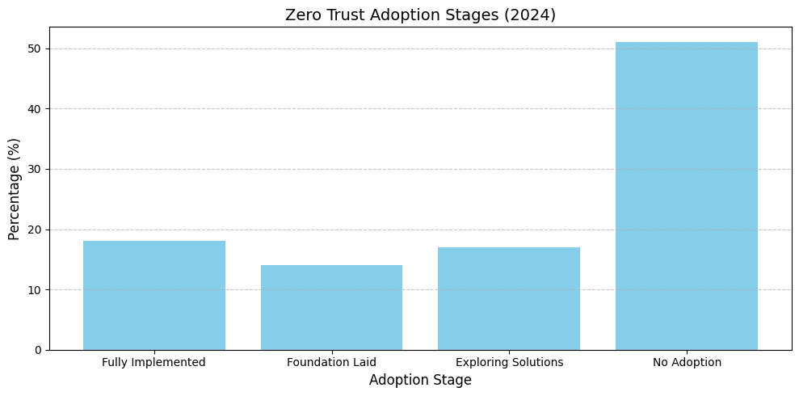
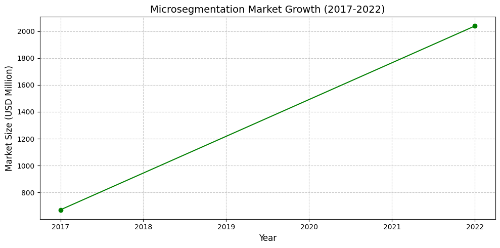

# Cisco Hypershield: A New Era of Network Security

As cyber threats grow in complexity, organizations face increasing challenges in protecting their digital ecosystems. Cisco, a global leader in networking and cybersecurity, has introduced Hypershield, a revolutionary security solution designed to address modern threats with advanced technologies. This article explores how Hypershield leverages Zero Trust principles and microsegmentation to redefine network security.

---

## Understanding Zero Trust and Microsegmentation

### Zero Trust: "Never Trust, Always Verify"

Zero Trust is a security model that continuously verifies users, devices, and applications before granting access. Unlike traditional approaches that assume trust within the network perimeter, Zero Trust assumes threats can originate from anywhere.

- **Adoption Statistics**:
    - As of 2024, 61% of organizations have adopted Zero Trust to some extent, but only 18% have fully implemented its principles.
    - The global Zero Trust market is projected to grow at a **CAGR of 15.2%**, reaching **USD 51.6 billion by 2028**.

#### Zero Trust Adoption Stages (2024)

---

### Microsegmentation: Dividing Networks for Better Security

Microsegmentation involves splitting a network into smaller segments, each with its own security controls. This approach minimizes lateral movement by attackers if they breach one segment.

- **Market Growth**:
    - The microsegmentation market grew from **USD 670.3 million in 2017** to **USD 2.04 billion by 2022**, with a projected CAGR of **23.7%** through 2031.
    - By 2032, the market is expected to reach **USD 116.3 billion**, reflecting the increasing demand for advanced segmentation solutions.

#### Microsegmentation Market Growth (2017–2022)

---

## What is Cisco Hypershield?

Cisco Hypershield is an AI-native security solution designed to protect data centers, cloud environments, and distributed networks. It integrates seamlessly into existing infrastructures and provides end-to-end protection.

### Key Features of Hypershield

1. **Intelligent Segmentation**:
    - Automatically partitions networks into secure segments.
    - Continuously adapts segmentation based on real-time behavior analysis and threat intelligence.

2. **Vulnerability Detection and Mitigation**:
    - Identifies potential attack vectors in minutes (compared to months with traditional methods).
    - Deploys precise controls to address vulnerabilities without disrupting operations.

3. **Secure Updates**:
    - Uses dual dataplane technology to test updates in a shadow environment before deploying them live.
    - Ensures minimal risk during policy changes or software upgrades.

---

## How Hypershield Enhances Zero Trust and Microsegmentation

Hypershield strengthens network security by:

- **Continuous Monitoring**: Tracks user and device behavior for anomalies.
- **AI-Driven Policies**: Automates the creation and adaptation of security rules.
- **Scalability**: Protects large-scale networks across on-premises, cloud, and hybrid environments.
- **Unified Management**: Combines multiple security functions into one platform for streamlined operations.

---

## Real-World Applications

While Hypershield is new, similar technologies have already demonstrated success:

1. A financial institution reduced its attack surface by **90%** through microsegmentation.
2. A healthcare provider enhanced IoT device security, cutting incidents by **60%**.
3. A government agency improved remote work security, reducing IT support issues by **30%**.

---

## Challenges in Implementation

Despite its benefits, adopting Hypershield comes with challenges:

1. **Integration**: Ensuring compatibility with existing tools.
2. **Training Needs**: IT teams require time to adapt to AI-driven systems.
3. **Platform Limitations**: Initial support is limited to Linux environments.
4. **Compliance Requirements**: Organizations must ensure regulatory alignment.

---

## Future Developments

Cisco plans to enhance Hypershield with:

- Expanded support for Windows servers and IoT devices.
- Hardware acceleration using Data Processing Units (DPUs).
- Advanced AI capabilities for faster threat detection and response.

---

Cisco Hypershield represents a transformative step in network security, combining AI-driven automation with advanced segmentation techniques. As cyber threats become more sophisticated, tools like Hypershield will play a critical role in safeguarding digital ecosystems across industries. With its ability to adapt dynamically and enforce Zero Trust principles at scale, Hypershield sets a new standard for protecting modern networks.
