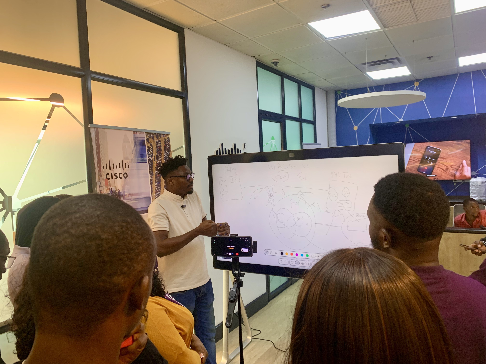
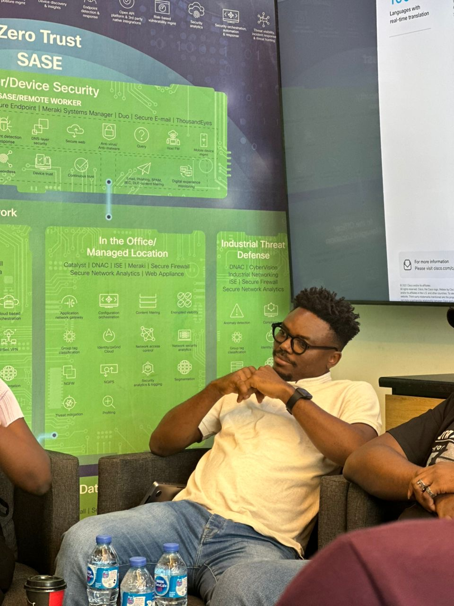
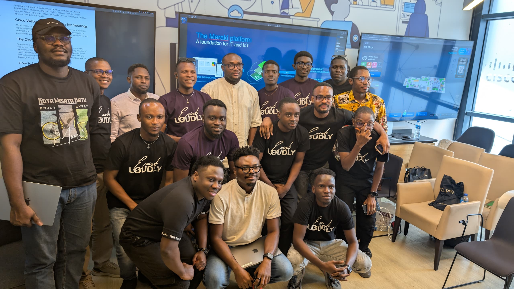

## Event Details

- **Event:** Cisco Edge Nigeria x Cyblack
- **Date:** Thursday, November 28, 2024
- **Time:** 10:00 AM
- **Role:** Speaker and Instructor

## Overview

I had the privilege of participating in the Cisco Edge Nigeria x Cyblack event, where I conducted a class on Network Backbone Connectivity and engaged in a fireside chat about building a career in tech and the importance of networking in the industry.

## Key Contributions

During the event, I covered several crucial topics:

1. Network Backbone Connectivity class
2. Fireside chat on tech career development and the essence of networking
3. Crash course on submarine optical networking and packet flow
4. Explanation of GSM and mobile communication
5. Discussion on backhaul operations from BTS to POP
6. Overview of sectorial antennas and RF in 3G and LTE cell phone connections

## Key Topics Covered

In addition to discussing my career journey and motivating aspiring network engineers, I delved into specialized topics related to submarine cable networks:

1. **Interconnecting Data Centers:** I explained how submarine cables play a crucial role in connecting data centers across continents, enabling high-speed, low-latency connectivity for large-scale data transfer. This connectivity is essential for applications such as backup, restore, caching, load balancing, and synchronization between data centers.

2. **Business Aspects of Submarine Networks:** I discussed the evolving business models in the submarine cable industry, including:
    - The shift from consortium to private cable ownership
    - The emergence of the condominium business model, where capacity ownership is sold to individual operators within the same cable
    - How this model can deliver attractive economies of scale and capital efficiency

3. **Global Connectivity:** I highlighted how submarine cables form the backbone of global internet infrastructure, carrying over 99% of intercontinental electronic communications traffic.

4. **Technological Advancements:** I touched on recent innovations in submarine networking, such as:
    - The adoption of coherent modems to maximize optical spectrum efficiency
    - The trend towards open submarine networks, similar to developments in terrestrial networking

5. **Impact on Edge Computing:** I explained how submarine cables are crucial in the worldwide edge ecosystem, enabling data exchange between businesses and end users at the edge.

## Impact and Networking

This event provided an excellent opportunity to share knowledge with aspiring tech professionals and emphasize the importance of understanding networking fundamentals in today's rapidly evolving technological landscape.

---
The Cisco Edge Nigeria x Cyblack event highlighted the critical role of networking expertise in the tech industry and the ongoing need for professionals to stay updated with the latest advancements in network technologies.
