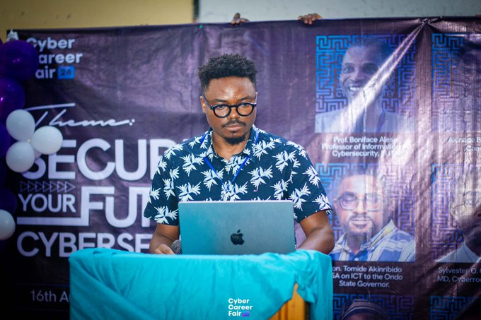
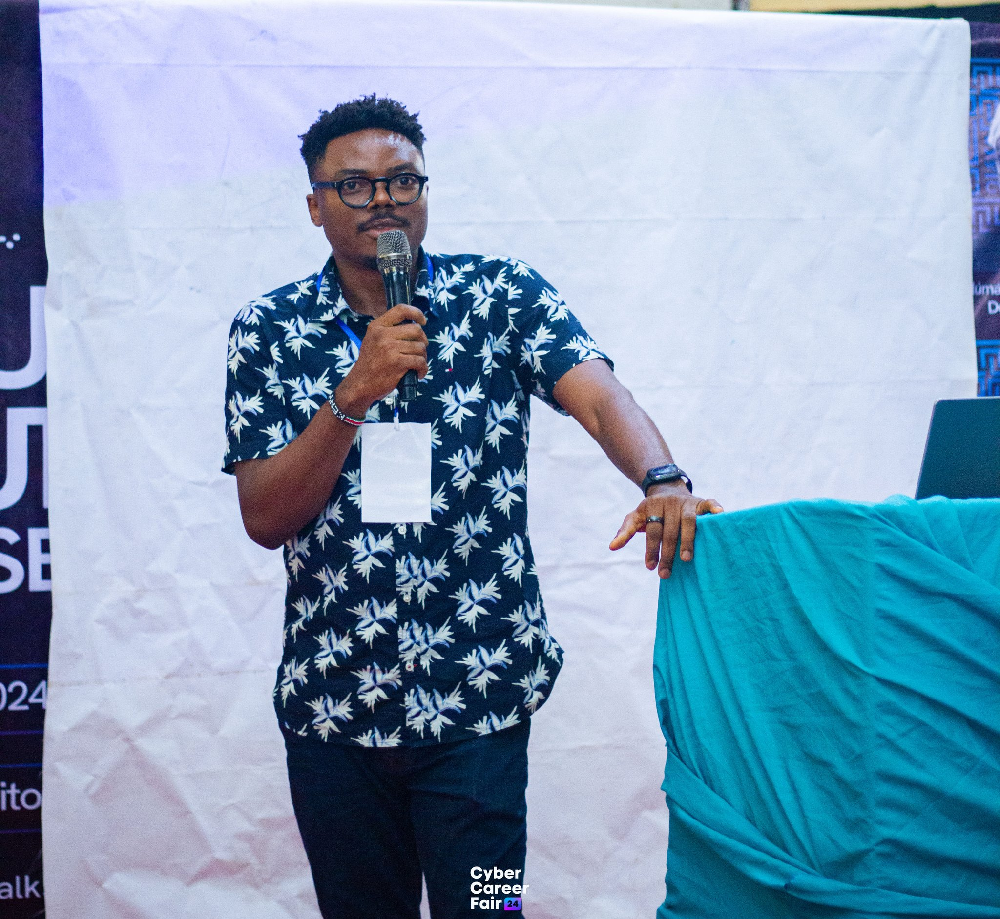

## Event Details

- **Event:** Cyber Career Fair (CCF) 2024
- **Date:** Friday, August 16, 2024
- **Venue:** Federal University of Technology Akure (FUTA)
- **Role:** Keynote Speaker
- **Presentation Title:** The Role of Continuous Education in Your Career

- 

## Overview

I had the honor of being invited as a keynote speaker at the Cyber Career Fair (CCF) 2024, hosted by the Federal University of Technology Akure (FUTA). This event, building on the success of its inaugural edition in 2023, aimed to provide a dynamic platform for cybersecurity professionals, students, educators, and industry leaders to engage in meaningful discussions, hands-on workshops, and networking opportunities.

## Event Highlights

The CCF 2024 featured a diverse range of activities, including:

1. Keynote addresses by industry leaders
2. Interactive workshops and training sessions
3. Expert panel discussions on critical issues and career strategies
4. Capture the Flag (CTF) competition
5. Live hacking demonstrations
6. Networking sessions

## Key Contributions

In my keynote address, I focused on "The Role of Continuous Education in Your Career," emphasizing:

- The rapidly evolving nature of the cybersecurity field
- Strategies for staying current with emerging technologies and threats
- The importance of lifelong learning in career advancement
- Practical approaches to balancing work, education, and personal growth

## Impact and Networking

This event provided an excellent opportunity to connect with the next generation of cybersecurity professionals, share insights from my career journey, and contribute to the growth of the cybersecurity community in Nigeria.

---

The Cyber Career Fair 2024 at FUTA demonstrated the institution's commitment to preparing students for the dynamic field of cybersecurity. It was a privilege to contribute to this important initiative and help shape the future of cybersecurity education and careers in Nigeria.
