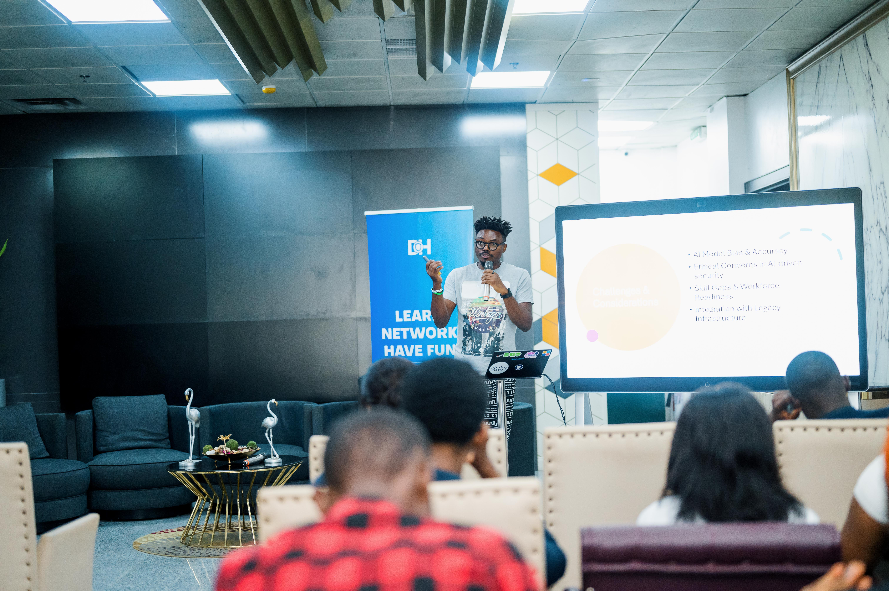
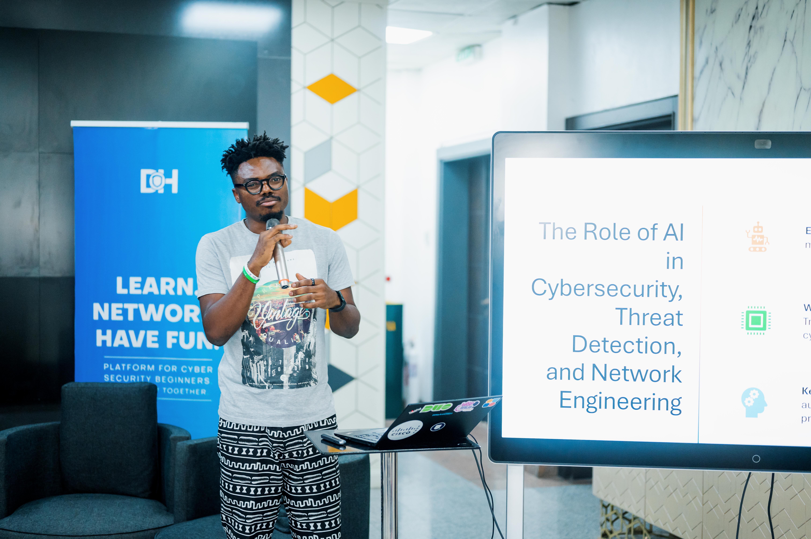
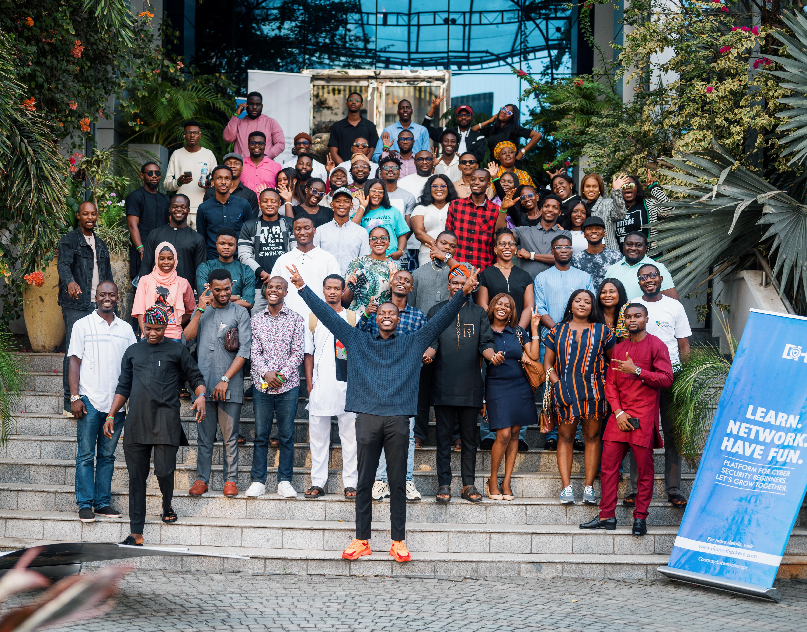

## Event Details

- **Event:** Lagos Cybersecurity Meetup: DiaryofHackersAfrica x Cisco Edge Africa
- **Date:** Friday, March 1, 2024
- **Theme:** Man vs Machine
- **Role:** Speaker
- 

## Overview

I had the privilege of speaking at the Lagos Cybersecurity Meetup, a collaborative event organized by DiaryofHackersAfrica and Cisco Edge Africa. The event, centered around the theme "Man vs Machine," brought together over 100 cybersecurity professionals and enthusiasts to explore the intersection of artificial intelligence and cybersecurity.

## Key Topics Covered

My presentation focused on three critical areas where AI is making significant impacts:

1. AI in Network Engineering
2. Automation in Cybersecurity
3. AI-Driven Threat Detection

### Evolution of Network Engineering

- Transition from manual configurations to AI-driven self-healing systems
- Shift from SNMP-based monitoring to intent-based networking
- Emergence of devices as sensors, providing rich telemetry data
- Centralized dashboards for improved troubleshooting and reduced Mean Time to Repair (MTTR)

### AI-Powered Network Automation Use Cases

1. **Configuration Management:** AI-driven self-configuring networks
2. **Zero-Touch Provisioning (ZTP):** Automated device setup and configuration
3. **AI-Based Traffic Optimization:** Intelligent routing and congestion mitigation
4. **Self-Healing Networks:** Auto-remediation of network issues

### AI in Threat Detection & Cybersecurity

- Identifying attack patterns through AI analysis of vast datasets
- Reducing false positives with enhanced detection accuracy
- Real-time anomaly detection via continuous monitoring of network traffic
- Behavior-based threat analysis evaluating user and system behavior
- Predictive analytics for forecasting potential attacks and enabling proactive defense

### Key Tools Discussed

- Cisco Meraki
- ThousandEyes
- AIOps Platforms
- NetFlow Analytics
- Cisco XDR
- SOAR (Security Orchestration, Automation, and Response)
- 

### Challenges and Future Trends

- Addressing AI model bias and accuracy
- Navigating ethical concerns in AI-driven security
- Bridging skill gaps and ensuring workforce readiness
- Integration challenges with legacy infrastructure
- Future developments in 6G, Edge Computing, Quantum Networking, and AI-driven Digital Twins
- 

## Impact and Networking

This event provided an excellent platform to discuss the transformative role of AI in network engineering and cybersecurity. It emphasized the importance of staying ahead of technological advancements and the need for continuous learning in the rapidly evolving field of cybersecurity.

The Lagos Cybersecurity Meetup highlighted the growing synergy between human expertise and machine intelligence in tackling modern cybersecurity challenges. As we navigate this new landscape, events like these are crucial for knowledge sharing and community building in the tech industry.
