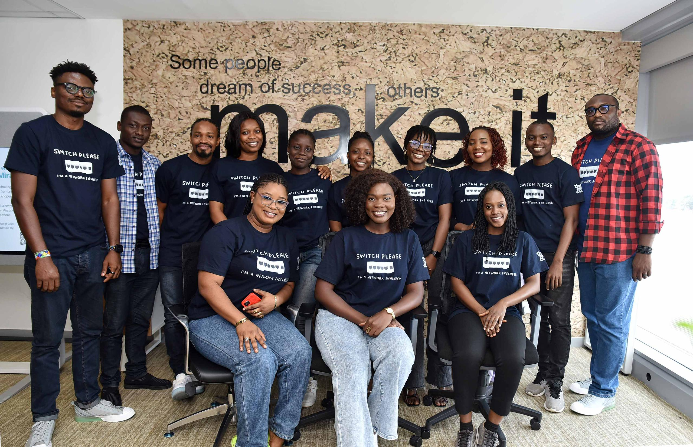
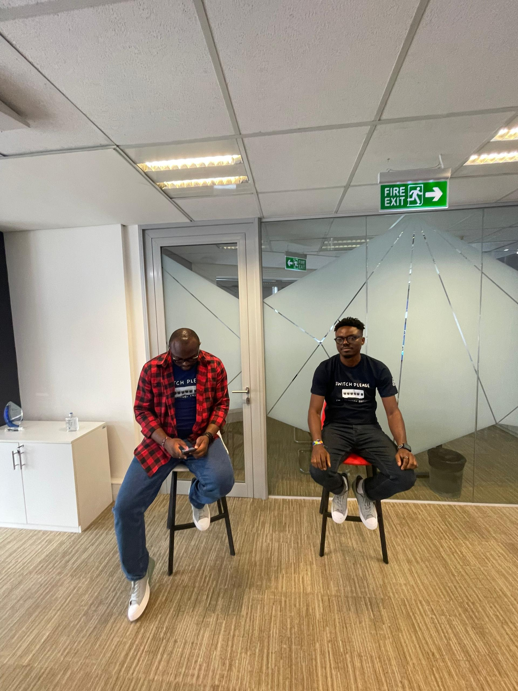

## Event Details

- **Event:** The NetClan Ladies in Network Engineering (LiNE) Program Graduation Ceremony
- **Date:** Tuesday, October 1, 2024
- **Time:** 10:00 AM - 12:30 PM
- **Venue:** Cisco Systems Office, Lagos, Nigeria
- **Role:** Panelist
- **Format:** Fireside Chat

## Overview

I had the honor of participating as a panelist at The Net Clan's Ladies in Network Engineering (LiNE) Program Graduation Ceremony. This event celebrated the accomplishments of the first cohort of participants and aimed to empower and equip them with the tools needed to thrive in the technology industry.

## Key Contributions

During the fireside chat, I shared insights on:

- My personal career journey in Network Engineering
- Challenges and opportunities for women in the field
- Motivational advice for aspiring female network engineers
- The importance of continuous learning and skill development in the rapidly evolving tech landscape

## Impact and Networking

The event provided an excellent platform for networking with both emerging talents and established professionals in the field. It was inspiring to connect with the graduating cohort and share experiences that could help shape their future careers in Network Engineering.

---

The Net Clan's LiNE Program Graduation Ceremony reinforced the importance of mentorship and community support in fostering the growth of women in technology. It was a privilege to contribute to this initiative and help motivate the next generation of female network engineers.